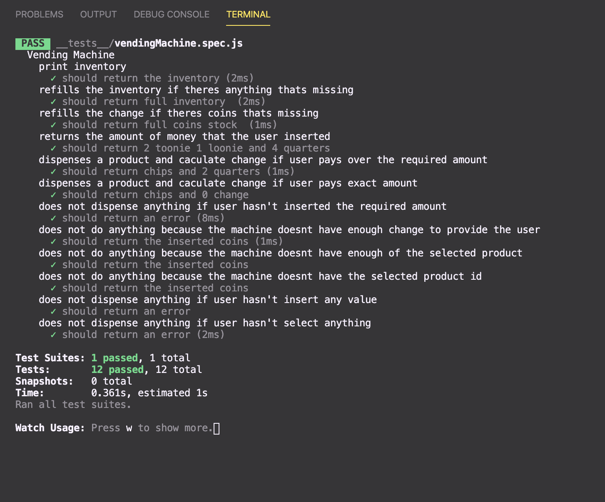

# Vending Machine Application

## Screenshots



## Project Description

The vending machine applications has 10 tests incorporated with it. It allows a user to purchase an item using coins and the machine would dispense the product and the necessary change for the user.

## Server

Commands must be run from the `server` directory:

### Installation

```bash
npm install
```

### Run

```bash
npm test
```

# Vending Machine Application

## Technologies Used & Key Learnings

- Jest
- Javascript
- TDD

## Personal Experience/ Learning Objective

Increased understanding on test driven development and javascript classes.

## Author

- Ivan - https://github.com/Ivandaixiv
